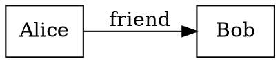

# Tutorial 4: Visualization

Visualizing your graph helps you understand its structure, find patterns, and communicate insights. This tutorial covers multiple visualization approaches with PQG.

## What You'll Learn

- Generating Graphviz DOT diagrams
- Creating interactive visualizations
- Exporting to GeoJSON for spatial data
- Highlighting specific nodes and edges
- Best practices for readable visualizations

## Prerequisites

- Completed previous tutorials
- Graphviz installed on your system (optional, for rendering)
- 20-25 minutes

## Installation Notes

For full visualization capabilities, install Graphviz:

```bash
# Ubuntu/Debian
sudo apt install graphviz

# macOS
brew install graphviz

# Windows
# Download from https://graphviz.org/download/
```

## Setup

We'll use a social network example that's perfect for visualization:

```python
import duckdb
from dataclasses import dataclass
from typing import Optional, List
from pqg import PQG, Base, Edge

@dataclass
class Person(Base):
    """A person in the social network"""
    name: Optional[str] = None
    age: Optional[int] = None
    city: Optional[str] = None

def create_social_network():
    """Create a sample social network graph"""

    db = duckdb.connect()
    graph = PQG(db, source="social_network")
    graph.registerType(Person)
    graph.initialize()

    # Create people
    people = [
        Person(pid="alice", name="Alice", age=28, city="New York"),
        Person(pid="bob", name="Bob", age=32, city="San Francisco"),
        Person(pid="carol", name="Carol", age=25, city="New York"),
        Person(pid="dave", name="Dave", age=30, city="Boston"),
        Person(pid="eve", name="Eve", age=27, city="San Francisco"),
        Person(pid="frank", name="Frank", age=35, city="Boston"),
    ]

    for person in people:
        graph.addNode(person)

    # Create relationships
    edges = [
        Edge(s="alice", p="friend", o=["bob", "carol"]),
        Edge(s="bob", p="friend", o=["alice", "dave", "eve"]),
        Edge(s="carol", p="friend", o=["alice", "dave"]),
        Edge(s="dave", p="friend", o=["bob", "carol", "frank"]),
        Edge(s="eve", p="friend", o=["bob", "frank"]),
        Edge(s="frank", p="friend", o=["dave", "eve"]),

        # Add some colleague relationships
        Edge(s="alice", p="colleague", o=["carol"]),
        Edge(s="bob", p="colleague", o=["eve"]),
        Edge(s="dave", p="colleague", o=["frank"]),
    ]

    for edge in edges:
        graph.addEdge(edge)

    db.commit()
    return db, graph
```

## Method 1: Graphviz DOT Format

The primary built-in visualization method:

```python
def basic_graphviz(graph):
    """Generate basic Graphviz visualization"""

    print("="*60)
    print("BASIC GRAPHVIZ VISUALIZATION")
    print("="*60)

    # Generate DOT format
    dot_lines = graph.toGraphviz()

    # Join into a single string
    dot_content = "\n".join(dot_lines)

    # Save to file
    with open("social_network.dot", "w") as f:
        f.write(dot_content)

    print("\nGraphviz DOT file saved to: social_network.dot")
    print("\nTo render as PNG:")
    print("  dot -Tpng social_network.dot -o social_network.png")
    print("\nTo render as SVG:")
    print("  dot -Tsvg social_network.dot -o social_network.svg")
    print("\nTo render as PDF:")
    print("  dot -Tpdf social_network.dot -o social_network.pdf")

    # Show a preview of the DOT content
    print("\nDOT content preview:")
    print("-" * 60)
    print("\n".join(dot_lines[:20]))
    if len(dot_lines) > 20:
        print(f"... ({len(dot_lines) - 20} more lines)")
```

### Understanding DOT Format

The DOT format looks like this:



## Method 2: Highlighting Nodes and Edges

Focus attention on specific parts of your graph:

```python
def highlighted_graphviz(graph):
    """Create visualization with highlighted elements"""

    print("\n" + "="*60)
    print("HIGHLIGHTED VISUALIZATION")
    print("="*60)

    # Highlight specific people
    highlighted_nodes = ["alice", "bob"]

    # Highlight specific relationships
    # Get edge PIDs for relationships we want to highlight
    friend_edges = []
    for s, p, o in graph.getRelations(predicate="friend"):
        # Edge PIDs are computed from their components
        edge = Edge(s=s, p=p, o=[o])
        friend_edges.append(edge.pid)

    # Generate with highlights
    dot_lines = graph.toGraphviz(
        nlights=highlighted_nodes,
        elights=friend_edges[:3]  # Highlight first 3 friendships
    )

    dot_content = "\n".join(dot_lines)

    with open("social_network_highlighted.dot", "w") as f:
        f.write(dot_content)

    print("\nHighlighted visualization saved to: social_network_highlighted.dot")
    print("Highlighted nodes: Alice, Bob")
    print("Highlighted edges: First 3 friend relationships")
```

## Method 3: Programmatic Rendering

Use Python libraries to render directly:

```python
def programmatic_rendering(graph):
    """Render Graphviz directly in Python"""

    print("\n" + "="*60)
    print("PROGRAMMATIC RENDERING")
    print("="*60)

    try:
        import graphviz

        # Get DOT content
        dot_lines = graph.toGraphviz()
        dot_content = "\n".join(dot_lines)

        # Create Graphviz Source object
        source = graphviz.Source(dot_content)

        # Render to file
        source.render("social_network_auto", format="png", cleanup=True)

        print("\nRendered to: social_network_auto.png")

        # Can also render to different formats
        source.render("social_network_auto", format="svg", cleanup=True)
        print("Rendered to: social_network_auto.svg")

    except ImportError:
        print("\nGraphviz Python library not installed.")
        print("Install with: pip install graphviz")
    except Exception as e:
        print(f"\nError rendering: {e}")
        print("Make sure Graphviz is installed on your system")
```

## Method 4: Custom DOT Styling

Create more visually appealing graphs:

```python
def custom_styled_visualization(graph):
    """Create a custom styled visualization"""

    print("\n" + "="*60)
    print("CUSTOM STYLED VISUALIZATION")
    print("="*60)

    # Start with basic DOT output
    dot_lines = graph.toGraphviz()

    # Customize the styling
    custom_dot = []
    custom_dot.append("digraph G {")
    custom_dot.append("  // Graph styling")
    custom_dot.append("  rankdir=TB;")  # Top to bottom
    custom_dot.append("  bgcolor=white;")
    custom_dot.append("  splines=ortho;")  # Orthogonal edges
    custom_dot.append("")
    custom_dot.append("  // Node styling")
    custom_dot.append("  node [")
    custom_dot.append("    shape=circle,")
    custom_dot.append("    style=filled,")
    custom_dot.append("    fillcolor=lightblue,")
    custom_dot.append("    fontname='Arial',")
    custom_dot.append("    fontsize=12")
    custom_dot.append("  ];")
    custom_dot.append("")
    custom_dot.append("  // Edge styling")
    custom_dot.append("  edge [")
    custom_dot.append("    fontname='Arial',")
    custom_dot.append("    fontsize=10,")
    custom_dot.append("    color=gray")
    custom_dot.append("  ];")
    custom_dot.append("")

    # Add nodes with custom labels
    person_ids = list(graph.getIds(otype="Person"))

    for pid in person_ids:
        person = graph.getNode(pid)
        name = person['name']
        age = person['age']
        city = person['city']

        # Create rich label
        label = f"{name}\\n{age} years\\n{city}"

        # Color by city
        colors = {
            "New York": "lightcoral",
            "San Francisco": "lightgreen",
            "Boston": "lightyellow"
        }
        color = colors.get(city, "lightgray")

        custom_dot.append(f'  {pid} [label="{label}", fillcolor={color}];')

    custom_dot.append("")

    # Add edges with different styles per relationship type
    for s, p, o in graph.getRelations():
        if graph.getNode(s).get('otype') != 'Person':
            continue

        if p == "friend":
            style = 'color=blue, penwidth=2'
        elif p == "colleague":
            style = 'color=green, penwidth=2, style=dashed'
        else:
            style = 'color=gray'

        custom_dot.append(f'  {s} -> {o} [label="{p}", {style}];')

    custom_dot.append("}")

    # Save custom styled version
    custom_content = "\n".join(custom_dot)

    with open("social_network_styled.dot", "w") as f:
        f.write(custom_content)

    print("\nCustom styled visualization saved to: social_network_styled.dot")
    print("\nFeatures:")
    print("  - Circular nodes")
    print("  - Color-coded by city")
    print("  - Different edge styles for relationship types")
    print("  - Rich labels with name, age, and city")
```

## Method 5: Subgraph Visualization

Visualize a portion of a large graph:

```python
def visualize_subgraph(graph, center_pid, max_depth=1):
    """Visualize only nodes near a central node"""

    print("\n" + "="*60)
    print(f"SUBGRAPH VISUALIZATION (center: {center_pid})")
    print("="*60)

    # Collect nodes and edges in the subgraph
    visited_nodes = set([center_pid])
    subgraph_edges = []

    def collect_neighbors(pid, depth):
        if depth > max_depth:
            return

        # Get outgoing edges
        for s, p, o in graph.getRelations(subject=pid):
            subgraph_edges.append((s, p, o))
            if o not in visited_nodes:
                visited_nodes.add(o)
                collect_neighbors(o, depth + 1)

        # Get incoming edges
        for s, p, o in graph.getRelations(obj=pid):
            subgraph_edges.append((s, p, o))
            if s not in visited_nodes:
                visited_nodes.add(s)
                collect_neighbors(s, depth + 1)

    collect_neighbors(center_pid, 0)

    # Build DOT for subgraph
    dot = ["digraph G {"]
    dot.append("  rankdir=LR;")
    dot.append("  node [shape=box, style=filled];")
    dot.append("")

    # Add nodes
    for node_id in visited_nodes:
        node = graph.getNode(node_id)

        # Center node gets special styling
        if node_id == center_pid:
            fill = "fillcolor=gold, penwidth=3"
        else:
            fill = "fillcolor=lightblue"

        label = node.get('name', node_id)
        dot.append(f'  {node_id} [label="{label}", {fill}];')

    dot.append("")

    # Add edges
    for s, p, o in subgraph_edges:
        dot.append(f'  {s} -> {o} [label="{p}"];')

    dot.append("}")

    filename = f"subgraph_{center_pid}.dot"
    with open(filename, "w") as f:
        f.write("\n".join(dot))

    print(f"\nSubgraph saved to: {filename}")
    print(f"Nodes in subgraph: {len(visited_nodes)}")
    print(f"Edges in subgraph: {len(subgraph_edges)}")

    return "\n".join(dot)
```

## Method 6: Statistical Visualizations

Create summary visualizations:

```python
def statistical_visualizations(graph):
    """Create statistical plots about the graph"""

    print("\n" + "="*60)
    print("STATISTICAL VISUALIZATIONS")
    print("="*60)

    try:
        import matplotlib.pyplot as plt

        # Count relationships per person
        person_ids = list(graph.getIds(otype="Person"))

        relationship_counts = {}
        for pid in person_ids:
            person = graph.getNode(pid)
            name = person['name']

            # Count outgoing relationships
            outgoing = len(list(graph.getRelations(subject=pid)))

            relationship_counts[name] = outgoing

        # Create bar chart
        plt.figure(figsize=(10, 6))
        plt.bar(relationship_counts.keys(), relationship_counts.values(), color='steelblue')
        plt.xlabel('Person')
        plt.ylabel('Number of Connections')
        plt.title('Social Network Connectivity')
        plt.xticks(rotation=45)
        plt.tight_layout()

        plt.savefig('network_statistics.png')
        print("\nStatistical plot saved to: network_statistics.png")

        plt.close()

        # Relationship type distribution
        predicate_counts = dict(graph.predicateCounts())

        plt.figure(figsize=(8, 6))
        plt.pie(
            predicate_counts.values(),
            labels=predicate_counts.keys(),
            autopct='%1.1f%%',
            startangle=90
        )
        plt.title('Distribution of Relationship Types')
        plt.tight_layout()

        plt.savefig('relationship_distribution.png')
        print("Relationship distribution saved to: relationship_distribution.png")

        plt.close()

    except ImportError:
        print("\nMatplotlib not installed.")
        print("Install with: pip install matplotlib")
```

## Method 7: GeoJSON Export (for Spatial Data)

If your graph has geographic information:

```python
def geojson_export_example():
    """Example of exporting spatial data to GeoJSON"""

    print("\n" + "="*60)
    print("GEOJSON EXPORT")
    print("="*60)

    # Create a graph with geographic data
    from dataclasses import dataclass
    from typing import Optional

    @dataclass
    class Location(Base):
        name: Optional[str] = None
        latitude: Optional[float] = None
        longitude: Optional[float] = None

    db = duckdb.connect()
    graph = PQG(db, source="locations")
    graph.registerType(Location)
    graph.initialize()

    # Add locations
    locations = [
        Location(pid="loc_1", name="New York", latitude=40.7128, longitude=-74.0060),
        Location(pid="loc_2", name="San Francisco", latitude=37.7749, longitude=-122.4194),
        Location(pid="loc_3", name="Boston", latitude=42.3601, longitude=-71.0589),
    ]

    for loc in locations:
        graph.addNode(loc)

    db.commit()

    # Export to GeoJSON (using CLI)
    print("\nTo export to GeoJSON, use the CLI:")
    print("  pqg geo locations.parquet > locations.geojson")

    # Save the graph first
    import pathlib
    graph.asParquet(pathlib.Path("locations.parquet"))

    print("\nGraph saved to: locations.parquet")
    print("You can now export to GeoJSON using the CLI command above")
```

## Visualization Best Practices

### 1. Keep It Simple

```python
# For large graphs, show only a subset
MAX_NODES = 50

if len(list(graph.getIds())) > MAX_NODES:
    print(f"Graph has {len(list(graph.getIds()))} nodes.")
    print(f"Visualizing only a {MAX_NODES}-node subgraph...")

    # Visualize subgraph around an interesting node
    visualize_subgraph(graph, "alice", max_depth=2)
else:
    # Visualize the whole graph
    dot_lines = graph.toGraphviz()
```

### 2. Use Labels Effectively

```python
# Good: Concise, readable labels
person = Person(
    pid="p_001",
    label="Alice (28)"  # Name and key info
)

# Avoid: Long descriptions in labels
person = Person(
    pid="p_001",
    label="Alice Smith, 28 years old, lives in New York, works as..."  # Too long!
)
```

### 3. Color Code Meaningfully

```python
# Color by type
node_colors = {
    "Person": "lightblue",
    "Organization": "lightgreen",
    "Project": "lightyellow"
}

# Color by property
def get_node_color(node):
    if node.get('importance') == 'high':
        return 'red'
    elif node.get('importance') == 'medium':
        return 'yellow'
    else:
        return 'lightgray'
```

### 4. Choose Appropriate Layout

Different rankdir values for different structures:

- `LR` (left-to-right): Good for hierarchies, workflows
- `TB` (top-to-bottom): Good for org charts, family trees
- `RL` (right-to-left): Alternative to LR
- `BT` (bottom-to-top): Alternative to TB

## Complete Example

```python
def main():
    """Run all visualization examples"""

    print("Creating social network...")
    db, graph = create_social_network()

    # Save to Parquet first
    import pathlib
    graph.asParquet(pathlib.Path("social_network.parquet"))

    # Generate visualizations
    basic_graphviz(graph)
    highlighted_graphviz(graph)
    programmatic_rendering(graph)
    custom_styled_visualization(graph)

    # Subgraph visualizations for each person
    for person_id in ["alice", "bob"]:
        visualize_subgraph(graph, person_id, max_depth=1)

    statistical_visualizations(graph)
    geojson_export_example()

    print("\n" + "="*60)
    print("ALL VISUALIZATIONS COMPLETE")
    print("="*60)
    print("\nGenerated files:")
    print("  - social_network.dot")
    print("  - social_network_highlighted.dot")
    print("  - social_network_styled.dot")
    print("  - social_network_auto.png")
    print("  - social_network_auto.svg")
    print("  - subgraph_*.dot")
    print("  - network_statistics.png")
    print("  - relationship_distribution.png")

if __name__ == "__main__":
    main()
```

## Visualization Tools Comparison

| Tool | Format | Interactive | Best For |
|------|--------|------------|----------|
| Graphviz | PNG, SVG, PDF | No | Publication-quality diagrams |
| NetworkX | PNG | No | Statistical analysis + viz |
| PyVis | HTML | Yes | Interactive exploration |
| Plotly | HTML | Yes | Web dashboards |
| Matplotlib | PNG | No | Statistical plots |
| GeoJSON | JSON | Yes (in GIS tools) | Geographic data |

## Exercises

### Exercise 1: Timeline Visualization

Create a visualization that arranges nodes by time (e.g., books by publication year).

### Exercise 2: Community Detection

Visualize communities in a social network using different colors for each community.

### Exercise 3: Heatmap

Create a heatmap showing connection strengths between nodes.

### Exercise 4: Interactive HTML

Use PyVis to create an interactive HTML visualization where you can:
- Click nodes to see details
- Drag nodes to rearrange
- Zoom and pan

Hint:
```python
from pyvis.network import Network

net = Network(height="750px", width="100%")
# Add nodes and edges from your PQG graph
net.show("interactive.html")
```

## Tips for Large Graphs

1. **Sample**: Show a representative subset
2. **Aggregate**: Combine similar nodes
3. **Filter**: Focus on most important relationships
4. **Hierarchical**: Create overview + detail visualizations
5. **Interactive**: Use tools like PyVis for exploration

## What's Next?

You've completed all four tutorials! Next steps:

- Read the [User Guide](../user-guide.md) for comprehensive reference
- Check the [CLI Reference](../cli-reference.md) for command-line usage
- Explore advanced topics like custom schemas and performance optimization
- Build your own graph application!

## Complete Code

The complete working code is available in `examples/tutorial_04_visualization.py`.
