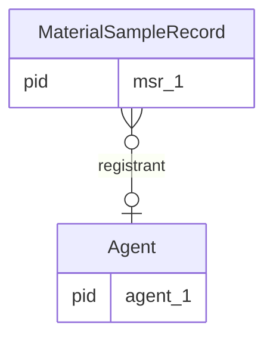

# iSamples Property Graph in Parquet

This document describes the parquet representation of iSamples material sample records.

The basic pattern is that rows in the parquet file represent nodes and edges. Each node entry corresponds with an instance of a class in the iSamples model. Columns are the union of columns across all the objects.

The iSamples parquet files are structured with a metadata section (stored in the parquet key-value metadata section), and the data section:

```
KV Metadata
  pqg_version
  pqg_primary_key
  pqg_node_types
  pqg_edge_fields
  pqg_literal_fields
Data
  entry 1
  entry 2
  ...
```

## KV Metadata

| Key | Value |
| -- | -- |
| `pqg_version` | "0.2.0" |
| `pqg_primary_key` | "pid" |
| `pqg_node_types` | JSON dictionary of node types |
| `pqg_edge_fields` | JSON list of edge fields in edge entries |
| `pqg_literal_fields` | JSON list of all literal value fields |


### `pqg_node_types`

```json
{
    
}
```

### `pqg_edge_fields`

```json
[]
```

### `pqg_literal_fields`

```json
[]
```

## Data

The full schema for the data portion is:

```
CREATE TABLE node(
    pid VARCHAR PRIMARY KEY, 
    tcreated INTEGER DEFAULT(CAST(epoch(current_timestamp) AS INTEGER)), 
    tmodified INTEGER DEFAULT(CAST(epoch(current_timestamp) AS INTEGER)), 
    otype VARCHAR, 
    s VARCHAR DEFAULT(NULL), 
    p VARCHAR DEFAULT(NULL), 
    o VARCHAR DEFAULT(NULL), 
    n VARCHAR DEFAULT(NULL), 
    altids VARCHAR[] DEFAULT(NULL), 
    geometry GEOMETRY DEFAULT(NULL), 
    authorized_by VARCHAR[], 
    has_feature_of_interest VARCHAR DEFAULT(NULL), 
    affiliation VARCHAR DEFAULT(NULL), 
    sampling_purpose VARCHAR DEFAULT(NULL), 
    complies_with VARCHAR[], 
    project VARCHAR DEFAULT(NULL), 
    alternate_identifiers VARCHAR[], 
    relationship VARCHAR DEFAULT(NULL), 
    elevation VARCHAR DEFAULT(NULL), 
    sample_identifier VARCHAR DEFAULT(NULL), 
    dc_rights VARCHAR DEFAULT(NULL), 
    result_time VARCHAR DEFAULT(NULL), 
    contact_information VARCHAR DEFAULT(NULL), 
    latitude DOUBLE DEFAULT(NULL), 
    target VARCHAR DEFAULT(NULL), 
    "role" VARCHAR DEFAULT(NULL), 
    scheme_uri VARCHAR DEFAULT(NULL), 
    is_part_of VARCHAR[], 
    scheme_name VARCHAR DEFAULT(NULL), 
    "name" VARCHAR DEFAULT(NULL), 
    longitude DOUBLE DEFAULT(NULL), 
    obfuscated BOOLEAN, 
    curation_location VARCHAR DEFAULT(NULL), 
    last_modified_time VARCHAR DEFAULT(NULL), 
    access_constraints VARCHAR[], 
    place_name VARCHAR[], 
    description VARCHAR DEFAULT(NULL), 
    "label" VARCHAR DEFAULT(NULL)
);
```

| Field | Description |
| -- | -- |
| `pid` | Unique identifier for the row. |  
| `tcreated` | Timestmap indicating the time the record in the files was created, not the time that the record was created in the content management system. |
| `tmodified` | Timestmap indicating the time the record was modified in this file. | 
| `otype` | Type of object represented by the row. Edges are always called "_edge_". | 
| `s` | The subject of the triple statement between two objects | 
| `p` | The predicate of the triple statement | 
| `o` | The object or target of the triple statement | 
| `n` | Optional name of the graph the statement exists in. | 

The possible values of `otype` are defined by the isamples linkml schema, and are:

```
│ Agent                   │
│ MaterialSampleRecord    │
│ SamplingEvent           │
│ GeospatialCoordLocation │
│ SamplingSite            │
│ IdentifiedConcept       │
│ MaterialSampleCuration  │
│ _edge_                  │       
```

The `_edge_` rows provide the relationships between objects. For example, the iSamples metadata model identifies that the [`MaterialSampleRecord`](https://isamplesorg.github.io/metadata/MaterialSampleRecord.html) has a property [`registrant`](https://isamplesorg.github.io/metadata/registrant.html), the values of which are instances of [`Agent`](https://isamplesorg.github.io/metadata/Agent.html).



Results in the following records:

| pid | otype | s | p | o | ...|
| -- | -- | -- | -- | -- | -- |
| `msr_1` | `MaterialSampleRecord` | null | null | null | |
| `agent_1` | `Agent` | null | null | null | |
| `45ef21` | `_edge_` | `msr_1` | `registrant` | `agent_1` | |


